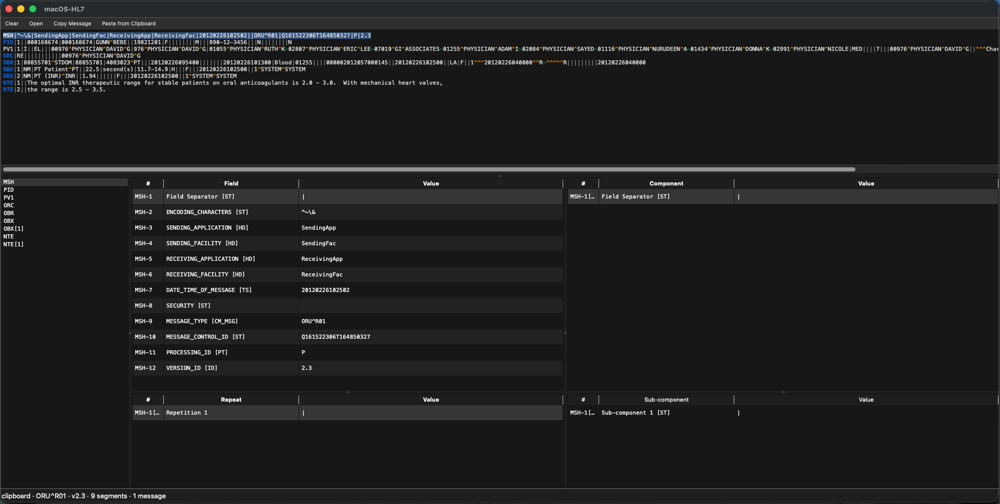

# macOS-HL7

A native macOS viewer for HL7 v2 messages. Paste an ER7 message, drop a `.hl7` file, or double-click one in Finder — the message is parsed and broken down into a three-pane field / component / sub-component view. Built for healthcare interface engineers who want to inspect HL7 quickly without leaving a Mac.

The UI is modeled on the Windows tool [SmartHL7](https://smarthl7.com/), which the macOS ecosystem has historically lacked an equivalent of.



## Features

- Three-pane layout: raw ER7 on top; segment list, field table, component table, repetition table, and sub-component table beneath.
- Tolerant parsing via [hl7apy](https://github.com/crs4/hl7apy) — malformed messages still render; a status-bar warning is shown when strict parsing fails.
- Delimiter-aware syntax highlighting — field, component, repetition, and sub-component separators are colored distinctly.
- MSH-1 and MSH-2 are rendered atomically (the field-separator and encoding-characters declaration are not subject to further delimiter parsing).
- Drag-and-drop `.hl7` / `.er7` / `.txt` files onto the window or paste ER7 text from the clipboard.
- Z-segment profiles — provide a YAML description of your custom Z-segments and their fields get typed, labeled display. Unknown positions fall back to generic `Field N [ST]`.
- Double-click `.hl7` files in Finder to open them in the app (file association declared in `Info.plist`).

## Copy behavior

Every cell in the field/component/repetition/sub-component tables is selectable and copyable. No values are hidden behind summary strings.

| Gesture                           | Copies                                                    |
|-----------------------------------|-----------------------------------------------------------|
| `⌘C` with rows selected           | Tab-separated `path\tlabel\tvalue` lines for each row     |
| Double-click a row                | The value cell only                                       |
| Right-click → **Copy Value**      | Just the value(s); one per line for multi-row selections  |
| Right-click → **Copy Row**        | Same as `⌘C` (path + label + value, tab-separated)        |
| Right-click → **Copy as JSON**    | Single object (or array) with `path`, `name`, `datatype`, `value` |

`path` is a navigable HL7 reference — e.g. selecting a sub-component row in `ZMH-7[0].3` yields a JSON record with path `ZMH-7[0].3.1`, so you can paste the snippet into tickets, notes, or tests and retain traceability to the original ER7 location.

## Keyboard shortcuts

| Shortcut | Action                               |
|----------|--------------------------------------|
| `⌘O`     | Open a file                          |
| `⌘V`     | Paste message from clipboard         |
| `⌘C`     | Copy selected rows (TSV) from tables |
| `⌘K`     | Clear the viewer                     |
| `⌘W`     | Close / quit                         |

## Requirements

- macOS 12+ (Apple Silicon or Intel)
- Python 3.11+ (build-time only; the `.app` bundle is self-contained)

## Run from source

```
make run
```

Creates a `.venv`, installs `PySide6`, `hl7apy`, `PyYAML`, and launches the viewer.

## Build the .app

```
make install-app
```

Builds `dist/macOS-HL7.app` via `py2app` and installs it to `/Applications/`. `.hl7` files open in the viewer on double-click afterward.

First build takes ~2 min. The resulting bundle is unsigned; macOS Gatekeeper will prompt on first launch (right-click → Open once to whitelist).

## Z-segment profiles

Z-segments — the custom local segments whose definitions are not part of the HL7 standard — are optionally supported via YAML profiles. The viewer works without them; Z-segment fields fall back to generic `Field N [ST]` / `Component N [ST]` labels.

Profiles are loaded from `app/zprofiles/zprofiles/` at startup if that directory exists. Because Z-segment definitions are organization-specific, the profile directory is **not bundled with this repo**. To add profiles, clone the companion repo as a git submodule:

```bash
git submodule add git@github.com:nathan-malinowski/macOS-HL7-zprofiles.git app/zprofiles
```

Or, if you already have the repo cloned elsewhere, symlink or copy the `zprofiles/` directory into `app/zprofiles/zprofiles/`.

See the companion repo for the YAML schema and per-segment files (`ZBX`, `ZDS`, `ZMG`, `ZMH`, `ZOB`, `ZOR`, `ZPI`, `ZPV`, `ZTS`). Any field or component you don't define falls back to generic labels automatically.

## Known limitations (v1)

Viewer only. No editing and re-encoding, no MLLP send/receive, no conformance validation against a profile, no diff between messages, no PHI redaction. These are all valid candidates for future versions — open an issue if you want one prioritized.

## Contributing

Bug reports and pull requests welcome. For development:

```
make install        # runtime deps only
make run            # launch from source
make install-build  # add py2app for bundling
make build          # produce dist/macOS-HL7.app
make clean          # drop build artifacts
make nuke           # also drop .venv
```

To add support for a new Z-segment, copy `app/zprofiles/_TEMPLATE.yaml.example` to `app/zprofiles/<NAME>.yaml` and fill in the field/component map.

Before opening a PR, run `python -m py_compile app/*.py` to make sure nothing broke syntactically.

## License

Released under the [MIT License](LICENSE). Third-party component licenses are documented in [THIRD_PARTY_LICENSES.md](THIRD_PARTY_LICENSES.md).

Acknowledgments: UX inspired by [SmartHL7](https://smarthl7.com/) (Windows). Parsing by [hl7apy](https://github.com/crs4/hl7apy). UI by [Qt for Python (PySide6)](https://wiki.qt.io/Qt_for_Python).
